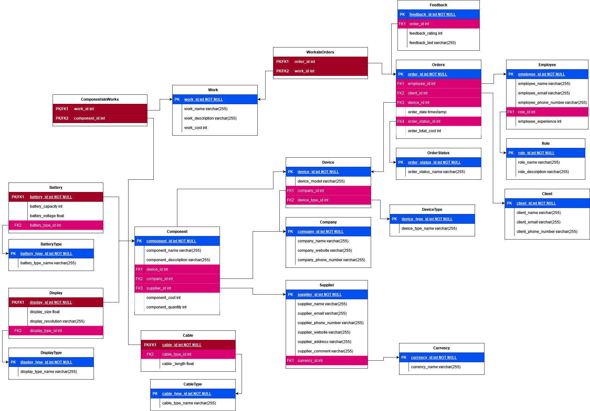

# Service Center Database 

## О проекте  
Этот проект выполнялся в рамках курсовой работы по предмету "Специальные главы БД". Проект должен содержать сочетание реляционной и документоориентированной баз данных и пользовательский интерфейс.  
В качестве предметной области выбран сервисный центр по починке мобильных устройств и подразумевается, что оно будет использовано сотрудниками сервисного центра.  
В качестве СУБД выбраны MySQL и MongoDB. Интерфейс реализован с помощью QT, приложение написано на C++. Сервера БД запускаются в Docker-контейнерах.

## Требования для запуска
Для запуска проекта на ОС Windows 10 требуется установить [Docker Desktop](https://docs.docker.com/desktop/install/windows-install/) и библиотеки QT.  
По мере разработки проекта требования будут уточняться.

## Используемые изображения
* [MySQL](https://hub.docker.com/_/mysql/)
* [MongoDB](https://hub.docker.com/_/mongo)

Приложение использует следующие порты:

| Server     | Port |
|------------|------|
| MySQL      | 3306 |
| MongoDB    |  --  |

## Установка проекта
Чтобы установить проект с помощью [Git](http://git-scm.com/book/en/v2/Getting-Started-Installing-Git), установите Git и следуйте следующим инструкциям:

```sh
git clone https://github.com/ngumbk/service_center_db.git
```

Чтобы попасть в директорию проекта, выполните следующую команду:

```sh
cd service_center_db
```
## Запуск проекта
1. Запуск приложения:

    ```sh
    docker-compose up -d
    ```

    **Первый запуск контейнеров может занять несколько минут...**

    ```sh
    docker-compose logs -f # Follow log output
    ```
2. Остановка приложения:

    ```sh
    docker-compose down -v
    ```

### Работа с базой данных

#### Доступ к CLI MySQL

```sh
docker exec -it mysql bash
```

и

```sh
mysql -u"$MYSQL_ROOT_USER" -p"$MYSQL_ROOT_PASSWORD"
```

## Описание базы данных
Реляционная база данных содержит 21 таблицу. Структура выглядит следующим образом:

NoSQL база данных пока не разработана.